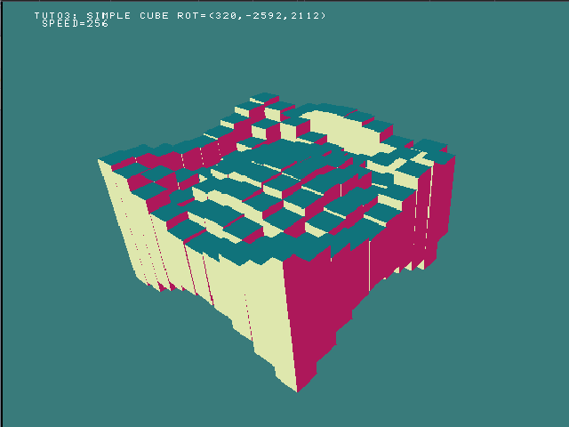

This is an attempt at a playstation version of the [cube wave by bees and bombs](https://beesandbombs.tumblr.com/post/149654056864/cube-wave).

The inspiration comes from Daniel Shiffman.

His version is in P5 or processing (one of those), and he has access to a "box" class, so 
the challenge for me will be to make such a class, as well as backface culling (and possibly occlusion culling).

fpsin from https://www.nullhardware.com/blog/fixed-point-sine-and-cosine-for-embedded-systems/

